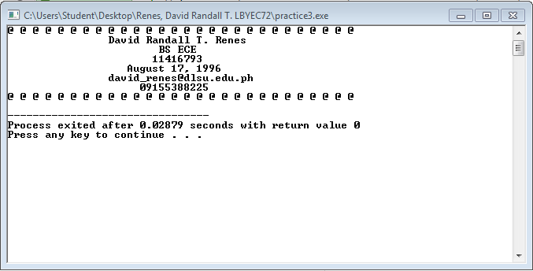

# Activity1-RenesD
```
#include <stdio.h>
#include <stdlib.h>

main()
{
	printf("Hello, LBYEC72!!! :D\n");
	system("pause");
	return 0;
}
```


```
#include <stdio.h>
#include <stdlib.h>
#define p printf

int main()
{
	system("color F0");
	p("@ @ @ @ @ @ @ @ @ @ @ @ @ @ @ @ @ @ @ @ @ @ @ @ @ @ @ @\n");
	p("\t\tDavid Randall T. Renes\n");
	p("\t\t        BS ECE\n");
	p("\t\t       11416793\n");
	p("\t\t   August 17, 1996\n");
	p("\t\tdavid_renes@dlsu.edu.ph\n");
	p("\t\t     09155388225\n");
	p("@ @ @ @ @ @ @ @ @ @ @ @ @ @ @ @ @ @ @ @ @ @ @ @ @ @ @ @\n");
	
	return 0;
}
```

