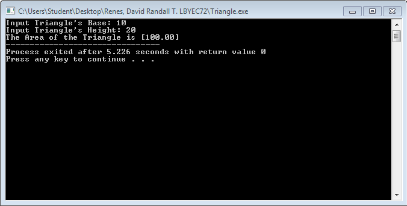
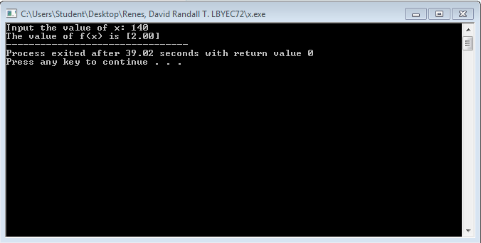

# Activity1-RenesD
```
#include <stdio.h>
#include <stdlib.h>

main()
{
	printf("Hello, LBYEC72!!! :D\n");
	system("pause");
	return 0;
}
```


```
#include <stdio.h>
#include <stdlib.h>
#define p printf

int main()
{
	system("color F0");
	p("@ @ @ @ @ @ @ @ @ @ @ @ @ @ @ @ @ @ @ @ @ @ @ @ @ @ @ @\n");
	p("\t\tDavid Randall T. Renes\n");
	p("\t\t        BS ECE\n");
	p("\t\t       11416793\n");
	p("\t\t   August 17, 1996\n");
	p("\t\tdavid_renes@dlsu.edu.ph\n");
	p("\t\t     09155388225\n");
	p("@ @ @ @ @ @ @ @ @ @ @ @ @ @ @ @ @ @ @ @ @ @ @ @ @ @ @ @\n");
	
	return 0;
}
```


```
#include <stdio.h>
#include <stdlib.h>
#define s scanf
#define p printf

main()
{
	float area, base, height;
	p("Input Triangle's Base: ");
	s("%f", &base);
	p("Input Triangle's Height: ");
	s("%f", &height);
	area=(base*height)/2;
	p("The Area of the Triangle is [%.2f]", area);
	
	return 0;
}
```



```
#include <stdio.h>
#include <stdlib.h>
#define s scanf
#define p printf

main()
{
	int year, age;
	p("Input Birth Year: ");
	s("%d", &year);
	age=2016-year;
	p("Your Age is approximately [%d].");
	
	return 0;
}
```


```
#include <stdio.h>
#include <stdlib.h>
#define s scanf
#define p printf

main()
{
	float x, x2;
	p("Input the value of x: ");
	s("%f", &x);
	x2=x/70;
	p("The value of f(x) is [%.2f]", x2);
	
	return 0;
}
```

